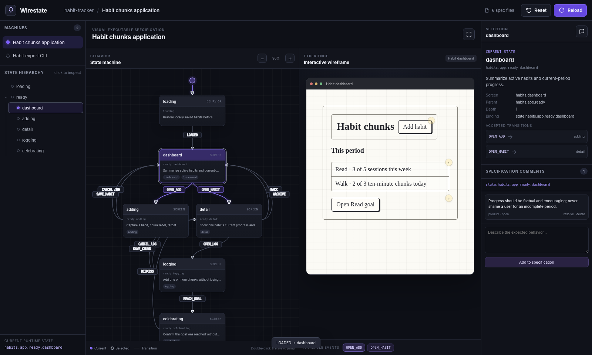

<div align="center">

# Wirestate

**Visual executable specifications for software.**

Define applications as composable state machines and lightweight interactive wireframes. Verify runtime behavior in CI, detect specification drift, and give coding agents a deterministic source of truth.

[](https://www.npmjs.com/package/wirestate)
[](#verification)
[](https://nodejs.org/)
[](https://www.typescriptlang.org/)
[](LICENSE)
[](https://alainux.github.io/wirestate/docs/)

[**Website**][website] · [**Documentation**][documentation] · [npm](https://www.npmjs.com/package/wirestate) · [Example](./examples/habit-tracker)

</div>

[][website]

> **Treat specifications as code.**
>
> Wirestate keeps application behavior, interactive prototypes, tests, and implementations aligned through executable specifications. The same checked-in specification powers visualization, simulation, runtime verification, CI policy, and AI-assisted development.

## Why Wirestate?

Requirements, mockups, tests, and implementation code usually drift because they are separate artifacts with weak links between them. Wirestate connects them through a small, repository-native specification:

```text
Specification → Interactive prototype → Application traces → Verification
      │                    │                       │
      └──────────── structured context for coding agents ────────────┘
```

Wirestate helps teams:

- Model application behavior with hierarchical, composable finite state machines.
- Build clickable low-fidelity prototypes from a minimal screen DSL.
- Keep specifications readable, diff-friendly, and colocated with implementation modules.
- Check source bindings in both directions so missing and unknown references fail visibly.
- Compare observed runtime traces with expected states and transitions.
- Report modeled behavior that tests have not demonstrated.
- Give AI coding agents structured intent instead of relying only on prose and screenshots.

Wirestate is not intended to replace application tests, a production state-management library, or a pixel-perfect design tool. It adds a behavioral contract above those tools.

## Features

- Hierarchical and composable state machines authored in YAML.
- Optional Balsamiq-style screens made from eight primitives: `Container`, `Text`, `Button`, `TextInput`, `Image`, `List`, `Toggle`, and `Modal`.
- A local IDE-style studio with a zoomable state graph and clickable wireframe shown side by side.
- Explicit state inspection and runtime jumping without conflating the two.
- Editable specification comments stored on the filesystem.
- A CLI for validation, inspection, simulation, interactions, synchronization, coverage, comments, serving, and smoke-test generation.
- Passive conformance through a language-neutral JSON/NDJSON trace protocol.
- Source linking through `data-wirestate-id`, `data-wirestate-state`, `@wirestate(...)`, and `wirestate:` comments.
- Project and global configuration files.
- JSON Schema support for editor integration.
- A colocated TypeScript habit-tracker example with browser and CLI entry points.
- Playwright helpers and generated smoke-test scaffolds.

## Quick start

Install the CLI globally:

```bash
npm install --global wirestate
```

Initialize and serve a project:

```bash
wirestate init
wirestate check
wirestate serve --open
```

Or work from this repository:

```bash
npm install
npm run build
node dist/cli.js check --cwd examples/habit-tracker
node dist/cli.js serve --cwd examples/habit-tracker --open
```

During development:

```bash
npm run check
npm run example:build
npm run example:check
npm run example:serve
```

Run the actual example application or its related export CLI in another terminal:

```bash
npm run example:app
npm run example:sync
```

The studio defaults to `http://127.0.0.1:4177`.

## A small specification

```yaml
wirestate: 1
namespace: checkout

machines:
  app:
    initial: cart
    states:
      cart:
        screen: cart
        bind: state:checkout.app.cart
        on:
          CHECK_OUT:
            target: payment
            interaction:
              kind: click
              component: checkout.submit

      payment:
        screen: payment
        bind: state:checkout.app.payment

screens:
  cart:
    root:
      type: Container
      children:
        - type: Text
          props:
            text: Your cart

        - id: checkout.submit
          type: Button
          bind: component:checkout.submit
          props:
            label: Check out
```

Application source can link to the specification without requiring a frontend framework:

```html
<main data-wirestate-state="checkout.app.cart">
  <button data-wirestate-id="checkout.submit">Check out</button>
</main>
```

Backend services and CLI applications can use decorators or comments through adapters:

```python
@wirestate("state:jobs.worker.running")
def run_job():
    ...
```

## Interactive prototype behavior

Transition interaction metadata connects a wireframe component to machine behavior:

```yaml
on:
  OPEN_ADD:
    target: adding
    interaction:
      kind: click
      component: habit.addButton
```

Clicking `habit.addButton` in the studio sends the interaction through the core resolver using the current machine state, component ID, and interaction kind. The browser does not implement a separate copy of the transition logic.

The same operation is available through the CLI:

```bash
wirestate interact \
  --machine habits.app \
  --state ready.dashboard \
  --component habit.addButton \
  --kind click
```

Buttons, toggles, inputs, and other supported primitives can therefore drive the prototype naturally. Explicit event controls and state jumps remain available for inspection and debugging.

## Runtime verification

Any test runner or application can emit the language-neutral NDJSON protocol:

```json
{"type":"state","machine":"checkout.app","state":"cart"}
{"type":"transition","machine":"checkout.app","from":"cart","event":"CHECK_OUT","to":"payment"}
{"type":"component","id":"checkout.submit","action":"click"}
```

Then verify the recorded behavior:

```bash
wirestate coverage .wirestate/traces/*.ndjson
wirestate check
```

`wirestate check`:

1. Validates the DSL.
2. Scans source and specification bindings in both directions.
3. Reads configured runtime traces.
4. Rejects unknown states and transitions.
5. Enforces configured state and transition coverage.

### Conformance and coverage

Wirestate treats these as separate signals:

- **Conformance** asks whether the application demonstrated behavior that contradicts or falls outside the model.
- **Coverage** asks which modeled states and transitions were actually demonstrated by tests.

An application can conform while still leaving much of the expected behavior uncovered. CI policies can enforce both independently.

```yaml
strict:
  bindings: true

coverage:
  states: 90
  transitions: 80
```

## CLI reference

```text
wirestate init
wirestate validate [--json]
wirestate inspect
wirestate graph [MACHINE] [--dot]
wirestate simulate --machine ID --events EVENT,EVENT
wirestate jump --machine ID --state ID
wirestate interact --machine ID --state ID --component ID --kind click|fill|toggle|submit|wait|custom
wirestate sync [--json]
wirestate coverage [TRACE...]
wirestate check [--json]
wirestate serve [--port PORT] [--open]
wirestate comment list|add|update|remove ...
wirestate smoke generate --machine ID --out FILE
```

Everything the studio can mutate maps to a core or CLI operation. The visual interface remains a replaceable surface over the same testable behavior.

## Configuration

A project can use `wirestate.config.yml`, `.wirestate.yml`, or their `.yaml` equivalents. Global configuration may be stored at `~/.config/wirestate/config.yml` or selected with `WIRESTATE_GLOBAL_CONFIG`.

```yaml
specs:
  - src/**/*.wire.yml

source:
  - src/**/*.ts
  - src/**/*.html
  - tests/**/*

trace:
  - .wirestate/traces/**/*.ndjson

strict:
  bindings: true

coverage:
  states: 90
  transitions: 80

server:
  port: 4177
  open: false
```

Project values override global values. Nested configuration objects are merged.

## Colocated TypeScript example

The included habit tracker is organized by implementation boundary rather than by a separate specification folder:

```text
examples/habit-tracker/
  src/
    shell/       browser entry point and application machine
    habits/      habit model, storage, screens, and component specs
    goals/       period progress, calculations, and completion screen
    sync-cli/    runnable export CLI and behavior-only machine
    shared/      reusable wireframe templates
```

The example supports:

- Daily and weekly goals.
- Progress recorded in measurable chunks.
- Dashboard summaries.
- Habit creation and archival.
- Habit detail and activity-logging states.
- Goal-completion behavior.
- A related CLI export workflow using a behavior-only machine.

The browser application records traces in `globalThis.__WIRESTATE_TRACE__`. The export CLI emits the same state and transition events as NDJSON to stdout.

```bash
npm run example:build
npm run example:app
npm run example:sync
```

## Detecting specification drift

The example test suite verifies both drift directions:

1. **Code changes without a specification update.** Removing a required source binding causes synchronization to report the binding as missing in code.
2. **Specification changes without an implementation update.** Renaming a specification binding causes synchronization to report the new binding as missing and the old source binding as unknown.

This does not make drift impossible. It makes drift observable, reviewable, and enforceable in CI.

## Verification

The current release was checked with:

- More than 90% line and function coverage in the core test suite.
- Unit, integration, HTTP, CLI, trace, and drift tests.
- Source/specification synchronization in both directions.
- Full modeled state and transition coverage in the checked-in example trace.
- Browser application and related TypeScript CLI builds.
- npm package-content and extracted-package smoke checks.

Run the complete local verification:

```bash
npm run check
npm run example:check
```

## Architecture

```text
YAML specifications
       │
       ▼
Loader → Validator → Normalized project
                         │
            ┌────────────┼────────────┐
            ▼            ▼            ▼
        Studio UI       CLI       Adapter API
            │            │            │
            └────────────┼────────────┘
                         ▼
               Runtime trace verifier
                         │
                         ▼
              Conformance and coverage
```

The core does not depend on a browser framework. Machines, screens, comments, traces, and reports normalize to JSON-compatible objects, allowing adapters in other languages to implement the same contracts without embedding the TypeScript runtime.

Passive trace validation is the reliable default. Active traversal is intentionally limited to Playwright smoke-test generation while fixture generation, guarded path planning, loop limits, and application-specific recovery remain behind an adapter boundary.

## Repository map

```text
src/                     core, CLI, server, and adapters
public/                  local split-view studio
site/                    GitHub Pages website and documentation
schema/                  JSON Schema for the DSL
docs/                    architecture and adapter contracts
examples/habit-tracker/  functional TypeScript example and specs
tests/                   unit, integration, drift, HTTP, and CLI tests
```

Detailed references:

- [Architecture](./docs/architecture.md)
- [DSL reference](./docs/dsl.md)
- [Adapter contracts](./docs/adapters.md)
- [Web documentation][documentation]

## FAQ

### Why are generated views and artifacts not manually editable?

Wirestate is designed for specification-first, agentic development. The checked-in specification is the source of truth. Graphs, previews, generated tests, scaffolds, and reports are derived projections that must be reproducible from it.

Directly editing derived output would create hidden state that cannot be regenerated reliably, may be overwritten, and leaves reviewers and coding agents unable to determine which representation expresses the intended behavior.

Humans and agents instead edit machines, screens, comments, and constraints through the filesystem, CLI, or supported specification-focused UI operations. Derived artifacts are then regenerated and verified deterministically.

This boundary does **not** prohibit editing application code or authoring specifications. It prevents generated projections from becoming competing sources of truth.

### Does Wirestate replace tests?

No. Tests still exercise the application and own fixtures, authentication, environment setup, and assertions. Wirestate adds a behavioral contract above them: conformance rejects behavior outside the model, while coverage reports modeled behavior that tests have not demonstrated.

### Does Wirestate replace XState or another runtime state library?

No. Wirestate is a specification and verification layer. An application may use XState, Redux, a backend workflow engine, ordinary functions, or no explicit runtime state-machine library at all.

### Does it verify pixel-perfect visual output?

Not in the core. The screen DSL models behavior and barebones layout rather than CSS. Screenshot, accessibility-tree, and semantic DOM adapters can provide additional evidence without turning the specification into a second frontend implementation.

### Why is passive verification the default?

Application-owned tests already know how to authenticate, create fixtures, and recover from environment-specific failures. Passive traces reuse that knowledge. Fully autonomous traversal additionally requires fixture providers, guard resolution, path planning, loop bounds, and recovery policies, so it remains an adapter concern.

### Can state machines be defined without screens?

Yes. Screens are optional. Behavior-only machines can model backend services, workers, workflows, and CLI tools using the same verification protocol.

### Is Wirestate language-specific?

The reference implementation and CLI use TypeScript, but the specification, bindings, and trace protocol are language-neutral. Other ecosystems can integrate through source scanners, decorators, comments, and trace adapters.

## Near-term roadmap

- Guard expressions and explicit nondeterministic transition selection.
- Parallel state regions and history states.
- Adapter SDKs for Java, Python, Go, Rust, and browser frameworks.
- Packaged Playwright fixtures and reporters with trace attachments.
- Path selection, fixture providers, and bounded active traversal.
- Git-aware comment attribution and review status.
- Precise source locations in normalized nodes and diagnostics.
- Incremental indexes for very large specifications.
- Deterministic code-generation contracts and agent manifests.

## Documentation site

The static website lives in `site/`. The included GitHub Actions workflow publishes that directory through GitHub Pages.

Preview it locally:

```bash
python3 -m http.server 8080 --directory site
```

Then open `http://localhost:8080`.

To deploy:

1. Replace `alainux` in the link definitions at the bottom of this README.
2. Push the repository to GitHub with `main` as the default branch.
3. Open **Settings → Pages** and choose **GitHub Actions** as the source.
4. Push a change under `site/` or manually run the **Deploy documentation site** workflow.

## Publishing the package

Authenticate, verify, and publish:

```bash
npm install
npm run check
npm pack --dry-run
npm login
npm publish --access public
```

npm publishing requires an account configured for secure publishing, such as two-factor authentication or an appropriate granular access token. For a scoped public package, use a scoped `name` in `package.json` and retain `--access public`.

For later releases:

```bash
npm version patch  # or minor / major
git push --follow-tags
npm publish --access public
```

## License

[MIT](LICENSE)

[website]: https://alainux.github.io/wirestate/
[documentation]: https://alainux.github.io/wirestate/docs/
